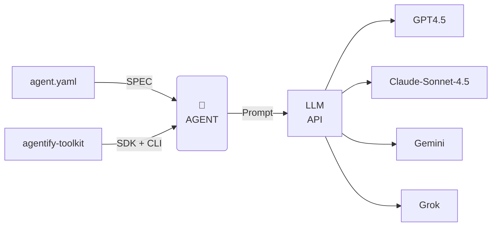

# Agent Building Toolkit - Agentify 🤖

[](https://pypi.org/project/agentify-toolkit/)
[](https://www.python.org/)
[](LICENSE)
[](https://colab.research.google.com/github/backplane-cloud/agentify-toolkit/blob/main/examples/notebooks/Agentify_Developer_Quickstart.ipynb)

> Agentify is a lightweight, declarative-first **AI agent building toolkit** for Python.

## 🚀 Getting Started

Prefer a hands-on walkthrough?

- 📘 [Agentify Developer Quickstart (Jupyter)](examples/notebooks/Agentify_Developer_Quickstart.ipynb)
- 📄 [Agentify YAML Deep Dive](examples/notebooks/Agentify_YAML_Deep_Dive.ipynb)

## How it works

Define your agents in simple YAML files or programmatically, and run them using an interactive CLI. Agentify abstracts LLM provider integrations and provides a simplified developer experience.

## Design Principles

- Declarative-first: YAML is the primary interface; Python is optional.
- Minimalism: Small, predictable API surface (run, chat, list).
- Provider-agnostic: Switch providers without rewriting agents.
- Predictability: Consistent behavior, validated YAML, versioning.
- Developer-first: CLI + notebooks for quick onboarding; clear errors.
- Extensibility: Optional memory, tools, and parameters; additive changes only.

## Architecture



## KeyFeatures

- Declarative agent definitions via YAML.
- Multi-LLM support: OpenAI, Anthropic, and more.
- Interactive CLI with TUI menu for exploring agents.
- Programmatic agent creation and execution for custom workflows.
- Lightweight, minimal dependencies: Click + Rich + PyYAML.

---

## Installation

```bash
pip install agentify-toolkit
```

Or install from source:

```bash
git clone https://github.com/backplane-software/agentify.git
cd agentify
pip install .
```

## Quick Start

### 1. Create an agent YAML

```yaml
name: claude
description: AI Engineer
version: 0.1.0
model:
  provider: anthropic
  id: claude-sonnet-4-5
  api_key_env: ANTHROPIC_API_KEY
role: |
  You are an AI Security Engineer.
  Provide concise, practical answers with examples.
```

### 2 .Run a single agent

```bash
agentify run examples/agent.yaml
```

### 3. Run agents interactively from a folder

```bash
agentify run examples/agents
```

### 4. List agents interactively

```bash
agentify list agents
```

## Programmatic Usage

Install agentify with `pip install agentify` and then import.

```python
from agentify import Agent

def main():

    agent = Agent(
        name="Grok",
        description="X's Grok Agent",
        provider="x",
        model_id="grok-4",
        role="You are an AI Security Architect specialising in X AI Grok models"
    )

    response = agent.run("Which AI LLM is the best in 1 sentence ?")
    print(response)

if __name__ == "__main__":
    main()
```

## CLI Reference

| Command                        | Example                     |
| ------------------------------ | --------------------------- |
| Run agent from YAML            | `agentify run <agent.yaml>` |
| Run all YAML Agents in folder  | `agentify run <folder>`     |
| List all YAML Agents in folder | `agentify list <folder>`    |

## Adding LLM API Keys

To use the LLM Model providers, you will need an API key and they will need to be made available in your environment.

Implemented providers:

| Provider  | Instruction                                    | Link                                 |
| --------- | ---------------------------------------------- | ------------------------------------ |
| OpenAI    | `export OPENAI_API_KEY="your_api_key_here"`    | https://platform.openai.com/api-keys |
| Anthropic | `export ANTHROPIC_API_KEY="your_api_key_here"` |                                      |
| Gemini    | `export GEMINI_API_KEY="your_api_key_here"`    |                                      |
| Bedrock   | `export AWS_BEARER_TOKEN_BEDROCK`              |                                      |
| GROK      | `export XAI_API_KEY="your_api_key_here"`       |                                      |

> For Windows:
> $env:<Provider\>\_API_KEY="YOUR_API_KEY"

## License

Agentify is licensed under the Apache License, Version 2.0.
See LICENSE for details.
