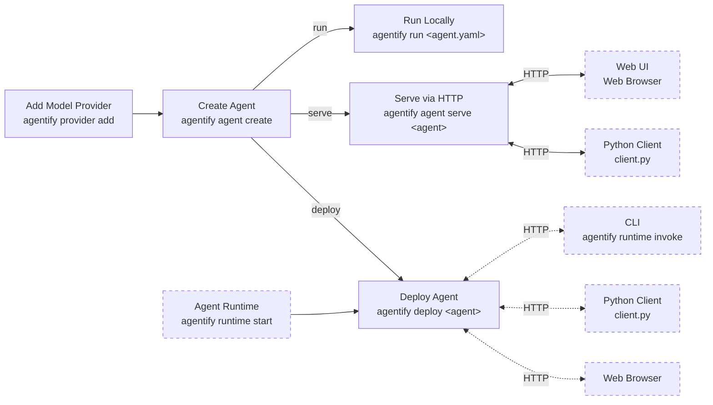

# CLI Reference

## Commands

| Command               | Description                                              |
| --------------------- | -------------------------------------------------------- |
| [provider](#provider) | Add/Remote AI Provider API Keys                          |
| [agent](#agent)       | Manage and inspect AI agent YAML files.                  |
| [run](#run)           | Run an agent from a YAML file or directory.              |
| [serve](#serve)       | Serve an agent locally via HTTP API and Web UI           |
| [deploy](#deploy)     | Deploy one or more agents to a running Agentify Runtime. |
| [runtime](#runtime)   | Start Agent Runtime for Hosting Agents                   |
| [gateway](#gateway)   | Unified API Endpoint (Model Gateway)                     |

> View the CLI workflow here: [cli-workflow](#cli-workflow)

## Provider

Agentify requires providers to be regsitered so that their API Keys can be used by the Agent when making calls.

| Command                    | Arguments [optional] | Description                                           | Example                              |
| -------------------------- | :------------------: | ----------------------------------------------------- | ------------------------------------ |
| `agentify provider add`    |   <provider_name>    | Add an AI Model Provider API KEY                      | `agentify provider add anthropic`    |
| `agentify provider remove` |      <provider>      | Remove a provider from local providers.yaml           | `agentify provider remove anthropic` |
| `agentify provider list`   |                      | List of registered Model Providers and API Key status |                                      |

## Agent

| Commands                |    Arguments [optional]     | Description                                  | Example                               |
| ----------------------- | :-------------------------: | -------------------------------------------- | ------------------------------------- |
| `agentify agent create` |       [<folder_path>]       | Create an Agent, outputs `<agent_name>.yaml` | `agentify agent create myagent`       |
| `agentify agent list `  |       [<folder_path>]       | Lists all agents in the current directory    | `agentify agent list examples/agents` |
| `agentify agent show`   | <file_name> \| <agent_name> | View the metadata of the Agent               |

## Run

Run your agent interactively (chat mode) for prompt testing

| Command        | Arguments     | Options                                      | Description                                                 | Example                        |
| -------------- | ------------- | -------------------------------------------- | ----------------------------------------------------------- | ------------------------------ |
| `agentify run` | <file.yaml>   | `--provider <provider>` `--model <model_id>` | Run a single agent with optional override on provider/model | `agentify run agent.yaml`      |
| `agentify run` | <folder_path> |                                              | Load Agent menu to choose agent to run                      | `agentify run examples/agents` |

> Dev Note: Add --prompt <prompt> e.g. `agentify run agent.yaml --prompt "test prompt"` for single shot prompt testing ?

## Serve

Serve a single agent as an API/Web Server on http://127.0.0.1:8001 for CLI and Programmatic testing

| Command          | Arguments   | Options       | Description                                       | Example                     |
| ---------------- | ----------- | ------------- | ------------------------------------------------- | --------------------------- |
| `agentify serve` | <file.yaml> | `--port 8002` | Run a single agent with optional override on port | `agentify serve agent.yaml` |

> Dev Note: Bring --provider and --model overrides to this command

## Deploy

Deploy your agent to the Agent Runtime for CLI and Programmatic testing

> Note: Before you can deploy agents to an Agent Runtime instance, you will need to start an instance with `agentify runtime start`. The instance will by default be available at http://localhost:8001

| Command           | Arguments     | Option | Description                                        | Example                           |
| ----------------- | ------------- | ------ | -------------------------------------------------- | --------------------------------- |
| `agentify deploy` | <file.yaml>   |        | Deploys a single agent to Agent Runtime            | `agentify run agent.yaml`         |
| `agentify deploy` | <folder_path> |        | Deploys all agents in folder_path to Agent Runtime | `agentify deploy examples/agents` |

## Runtime

An Agent Runtime acts as a deploy target for agents for CLI, Web and Programmatic testing

| Command                      |  Arguments   | Options               | Description                                               |
| ---------------------------- | :----------: | --------------------- | --------------------------------------------------------- |
| `agentify runtime start`     |              | `--port 8001`         | Starts the Agent Runtime API Server                       |
| `agentify runtime list`      |              |                       | List all agents currently deployed on the runtime server. |
| `agentify runtime terminate` | <agent_name> |                       | Terminate an agent                                        |
| `agentify runtime invoke `   | <agent_name> | `--prompt "a prompt"` | Delete an agent from the runtime server.                  |

> Note: You must ensure that the API keys for your model providers have been loaded into the environment before starting the Agent Runtime server. Use `agentify provider list` to double-check and `agentify provider add <provider_name>`

## Gateway

| Command                  | Arguments | Options           | Description                         |
| ------------------------ | :-------: | ----------------- | ----------------------------------- |
| `agentify gateway start` |           | `--port 8001` TBC | Starts the Model Gateway API Server |

<!-- ## Config

| Command                             | Arguments / Options | Description                                                         |
| ----------------------------------- | ------------------- | ------------------------------------------------------------------- |
| `agentify config show`              |                     | Display current Agentify configuration (e.g., runtime server).      |
| `agentify config set <key> <value>` |                     | Set a configuration value (future extensibility, e.g., auth token). | -->

## CLI Workflow

