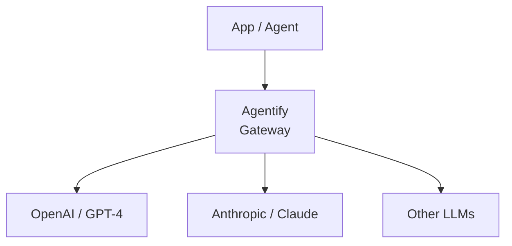
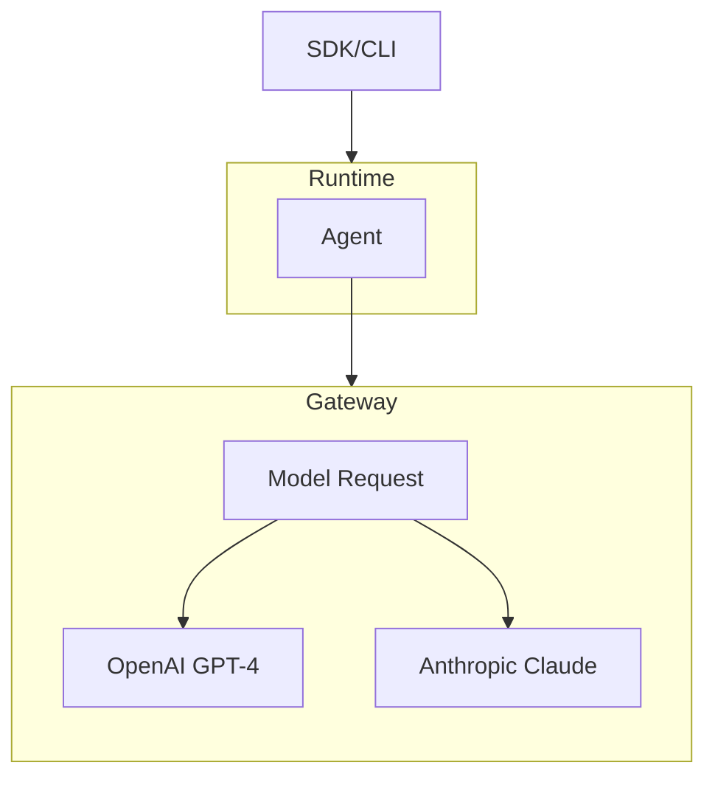

# Agentify Model Gateway (v0.16.0)

> **TL;DR:** Agents can now use provider: `agentify` to route calls via a centralised gateway, enabling runtime model selection and simplified multi-agent workflows.

The Agentify Toolkit v0.15.0 introduces the Model Gateway, allowing Agentify to serve as a model provider.

Agents can now route requests to different models dynamically, without per-agent provider configuration.

## Contents

1. [Use Case](#use-case)
2. [High-level Architecture](#high-level-architecture)
3. [Demo](#demo)
4. [Examples](#examples)
5. [Engineering Benefits](#engineering-benefits)
6. [Usage Recommendations](#usage-recommendations)
7. [Runtime Integration](#runtime-integration)

## Use Case

The Model Gateway addresses common challenges in multi-agent and multi-model setups:

- **Centralised provider configuration**: credentials and endpoints are managed in a single location
- **Runtime model selection**: agents can specify which model to use at runtime (vendor/model)
- **Provider-agnostic workflows**: switch or add providers without changing agent code

This makes rapid experimentation, testing, and prototyping simpler and more consistent.

## High-level Architecture



The Model Gateway provides a single API endpoint that your agents target. The gateway then routes calls to the correct model endpoint.

# Try it out

## Start Gateway

First start the Agentify Model Gateway.

```bash
agentify gateway start
```

> It will run on http://localhost:8000 by default. In future updates, the host port will be configurable via param options e.g. `agentify gateway start --port 8080`

## Build Agents

### Using the SDK:

Example: agent.py

```python
from agentify import Agent

def main():

    agent = Agent(
        name="Agentify",
        description="Agentify Model Demo Agent",
        provider="agentify", # <-- Model Gateway
        model_id="openai/gpt-4", # <-- vendor/model
        role="You are an AI Security Architect specialising in Agentify Model Gateway"
    )

    response = agent.run("Write a short summary of the Agentify Model Gateway?")
    print(response)

if __name__ == "__main__":
    main()

```

Then run the Agent:

```bash
python3 agent.py
```

### Using CLI:

Example: `agent.yaml`

```yaml
name: agentify
description: This is an example Backplane Agent
version: 0.1.0
model:
  provider: agentify # <-- Routes to Model Gateway
  id: openai/gpt-4 # <-- New
  api_key_env: OPENAI_API_KEY
role: You are a Backplane AI Agent
```

```bash
agentify run agent.yaml
```

The agent runtime will:

1. Load the agent definition from agent.py
2. Connect to the Agentify Model Gateway
3. Route calls to the configured model at runtime

## Engineering Benefits

- Unified endpoint simplifies multi-agent setups
- Runtime flexibility: choose models dynamically
- Centralised authentication across providers
- Framework-agnostic: works with all supported LLM providers

## Usage Recommendations

- Define agents and tools declaratively to leverage the runtime fully
- Use the gateway for multi-agent experiments to simplify routing

## Runtime Integration



The Model Gateway works hand-in-hand with the [Agentify Runtime](RUNTIME.md). Agents and tools are defined declaratively, and the runtime resolves model calls at execution time.

This separation allows:

- Changing the model for an agent without modifying its definition
- Multi-agent workflows to run using a single unified endpoint
- Rapid testing and prototyping across providers
