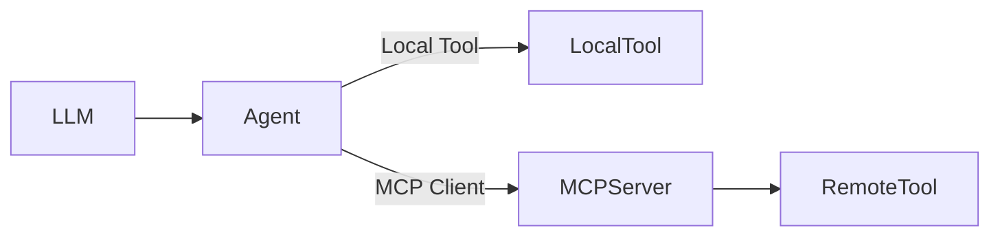

# Agentify MCP (Model Context Protocol)

## Overview

Agentify includes a lightweight HTTP-based MCP (Model Context Protocol) implementation that enables:

- Hosting tools on a standalone MCP server
- Publishing tools dynamically via CLI
- Invoking remote tools from agents
- Clean separation between agent runtime and tool execution

The MCP system consists of four parts:

1. **MCP Server** – Hosts and executes tools over HTTP
2. **MCP Client** – Used by agents to communicate with the server
3. **CLI Commands** – Developer ergonomics for managing tools
4. **Agent Integration** – Automatic discovery and invocation of remote tools

---

# Architecture



The Agent decides whether a tool call is:

- Local (defined in agent.yaml)
- Remote (hosted on an MCP server)

---

# MCP Server

The MCP server is a minimal FastAPI-based HTTP service.

## Start the server

```bash
agentify mcp start
```

Default:

```
http://127.0.0.1:3333
```

---

## Server Endpoints

### List Tools

```
GET /tools
```

Returns:

```json
{
  "tools": [
    {
      "name": "add",
      "description": "Add two numbers",
      "input_schema": { ... }
    }
  ]
}
```

---

### Show Tool

```
GET /tools/{tool_name}
```

---

### Publish Tool

```
POST /tools
```

Accepts JSON tool specification:

```json
{
  "name": "random_user",
  "description": "Generate random user data",
  "endpoint": "https://randomuser.me/api/"
}
```

---

### Invoke Tool

```
POST /tools/{tool_name}/invoke
```

Request:

```json
{
  "arguments": { "a": 10, "b": 10 }
}
```

Response:

```json
{
  "result": 20
}
```

---

### Remove Tool

```
DELETE /tools/{tool_name}
```

---

# MCP Client

The MCP client is used internally by agents.

Responsibilities:

- Discover tools (`GET /tools`)
- Fetch tool schemas
- Invoke remote tools
- Fail gracefully if server is unavailable

Example usage:

```python
client = MCPClient("http://localhost:3333")
tools = client.list_tools()
result = client.invoke("add", {"a": 10, "b": 10})
```

If the server is unavailable:

- Agent creation does not fail
- MCP tools are simply not loaded
- Local tools continue to work

---

# CLI Commands

## Start MCP Server

```bash
agentify mcp start
```

---

## List MCP Tools

```bash
agentify mcp list
```

---

## Show Tool

```bash
agentify mcp show <tool_name>
```

---

## Invoke Tool

```bash
agentify mcp invoke <tool_name> --args '{"a": 10, "b": 10}'
```

---

## Publish Tool to Server

```bash
agentify tool publish tool.yaml --server http://localhost:3333
```

This converts a YAML tool definition into JSON and registers it with the MCP server.

---

## Remove Tool

```bash
agentify mcp remove <tool_name>
```

---

# Agent Integration

Add MCP configuration to `agent.yaml`:

```yaml
name: ollama
model:
  provider: ollama
  id: devstral-small-2:24b

tools:
  - random_user

mcp:
  endpoint: http://localhost:3333
```

At runtime:

1. Agent loads local tools
2. Agent connects to MCP server
3. Agent fetches remote tool schemas
4. Agent merges local + MCP tools into prompt context
5. LLM can invoke either

---

# Tool Invocation Flow

1. User prompt
2. LLM returns JSON tool call
3. Agent parses JSON
4. If local tool → execute locally
5. If MCP tool → call MCP client → call server
6. Tool result returned to LLM

---

# Design Principles

- MCP is optional
- Remote tools are best-effort
- Agent never crashes if MCP is offline
- Clean separation of transport (client) and execution (server)
- CLI mirrors HTTP capabilities

---

# Current Scope

This implementation provides:

- HTTP-based MCP server
- In-memory tool registry
- Dynamic tool publishing
- Remote invocation
- Graceful failure handling

Future enhancements may include:

- Authentication
- Persistent registry storage
- Namespaced tools
- Tool versioning
- Schema normalization between local and MCP tools

---

# Summary

Agentify MCP introduces distributed tool execution while keeping agents simple.

Agents remain orchestration layers.
Tools can live locally or remotely.
The MCP server provides a clean, minimal, inspectable implementation suitable for development and extension.
