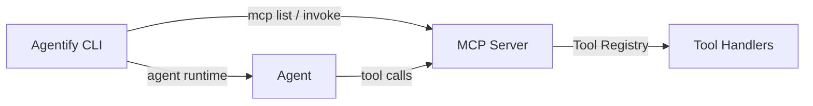

# MCP (Model Context Protocol)

Agentify includes a built-in **MCP Server** that allows tools to be exposed over HTTP and consumed by agents or other clients. This enables clean separation between **agents** (reasoning + models) and **tools** (capabilities), and makes tools reusable across agents and runtimes.

This page gives a concise, end-to-end guide to get you up and running.

---

## What MCP Provides

At a high level, MCP gives you:

- A **tool server** that exposes capabilities over HTTP
- **Tool discovery** via a standard endpoint
- **Tool invocation** using JSON input/output
- A clean boundary between local tools and remote tools

In Agentify, MCP is:

- HTTP-first (not stdin-based)
- Stateless
- Simple by design
- Vendor-neutral

---

## Starting the MCP Server

To start the MCP server locally:

```bash
agentify mcp start
```

By default, this starts an HTTP server on:

```
http://127.0.0.1:3333
```

You can override the bind address if needed:

```bash
agentify mcp start --host 0.0.0.0 --port 8080
```

Once running, the server exposes tool discovery and invocation endpoints.

---

## Listing Available Tools

To list all tools exposed by the MCP server:

```bash
agentify mcp list
```

This command calls:

```
GET /tools
```

And displays the available tools in a clean table, including:

- Tool name
- Description

Example output:

```
Tool Name   Description
echo        Echo back the provided arguments
add         Add two numbers
```

---

## Invoking a Tool

To invoke a tool exposed by the MCP server:

```bash
agentify mcp invoke add --args '{"a": 2, "b": 3}'
```

This command:

- Sends a JSON payload to the MCP server
- Invokes the selected tool
- Prints the result in a readable format

Under the hood, this calls:

```
POST /tools/{tool_name}/invoke
```

With a request body of the form:

```json
{
  "arguments": {
    "a": 2,
    "b": 3
  }
}
```

Example output:

```
Result
──────
5
```

Tools may return scalars, objects, or arrays — all are supported.

---

## How MCP Fits Into Agentify

MCP cleanly separates responsibilities:

- **Agents** reason, plan, and orchestrate
- **Tools** perform concrete actions
- **MCP servers** host and expose tools

Local tools and MCP-hosted tools can coexist. When both exist, local tools take precedence unless explicitly qualified.

---

## Architecture Overview



---

## When to Use MCP

Use MCP when you want to:

- Share tools across multiple agents
- Run tools out-of-process or remotely
- Keep agents lightweight and declarative
- Integrate external systems cleanly

---

## Summary

With MCP in Agentify you can:

- Start a local or remote tool server
- Discover tools via a standard interface
- Invoke tools consistently using JSON
- Build agents that consume capabilities, not implementations

This keeps Agentify modular, composable, and ready to scale.
