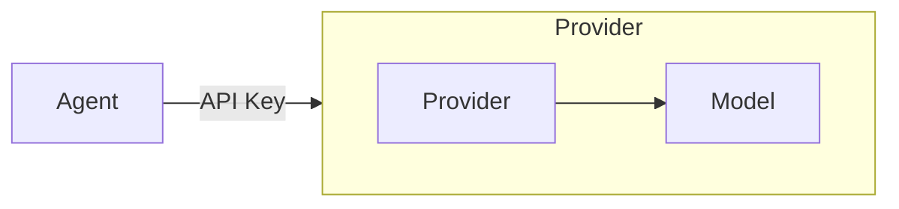

# Providers

### Overview

Providers define how Agentify connects to Large Language Model (LLM) backends.
Each provider represents a configured integration with a model vendor, including
authentication, supported models, and execution constraints.

Before an agent can invoke a model, a provider must be registered locally using
a valid API key or credential source.

### Conceptual model

| Concept  | Description                                                                     |
| -------- | ------------------------------------------------------------------------------- |
| Provider | A configured connection to an LLM vendor (e.g. OpenAI, Anthropic, Bedrock)      |
| Model    | A concrete model offered by that provider (e.g. `gpt-4.1`, `claude-3.5-sonnet`) |
| Agent    | Selects a model at runtime without needing to manage provider credentials       |

This separation allows agents to remain portable while provider configuration
remains local and secure.

#### Providers contain Models

### Managing providers

- Providers are managed using the `agentify provider` command group.

- API KEYS are stored locally in environment variables (e.g. `<PROVIDER>_API_KEY`)

#### CLI Reference

| Command                               | Arguments [optional] | Description                                           |
| ------------------------------------- | :------------------: | ----------------------------------------------------- |
| `agentify provider add <provider>`    |     < provider >     | Add an AI Model Provider API KEY                      |
| `agentify provider remove <provider>` |     < provider >     | Remove a provider from local providers.yaml           |
| `agentify provider list`              |                      | List of registered Model Providers and API Key status |

### Supported Providers

| Name        | Command                  | API Key instructions                     |
| ----------- | ------------------------ | ---------------------------------------- |
| OpenAI      | `agentify add openai`    | [Instructions](./providers/OPENAI.md)    |
| Anthropic   | `agentify add anthropic` | [Instructions](./providers/ANTHROPIC.md) |
| Deepseek    | `agentify add deepseek`  | [Instructions](./providers/DEEPSEEK.md)  |
| Mistral     | `agentify add mistral`   | [Instructions](./providers/MISTRAL.md)   |
| XAI         | `agentify add xai`       | [Instructions](./providers/XAI.md)       |
| Google      | `agentify add google`    | [Instructions](./providers/GOOGLE.md)    |
| AWS Bedrock | `agentify add bedrock`   |                                          |
| Github      | `agentify add github`    | [Instructions](./providers/GITHUB.md)    |
| Ollama      | `agentify add ollama`    | [Instructions](./providers/OLLAMA.md)    |

> Local-only providers (e.g. Ollama) do not require API keys
