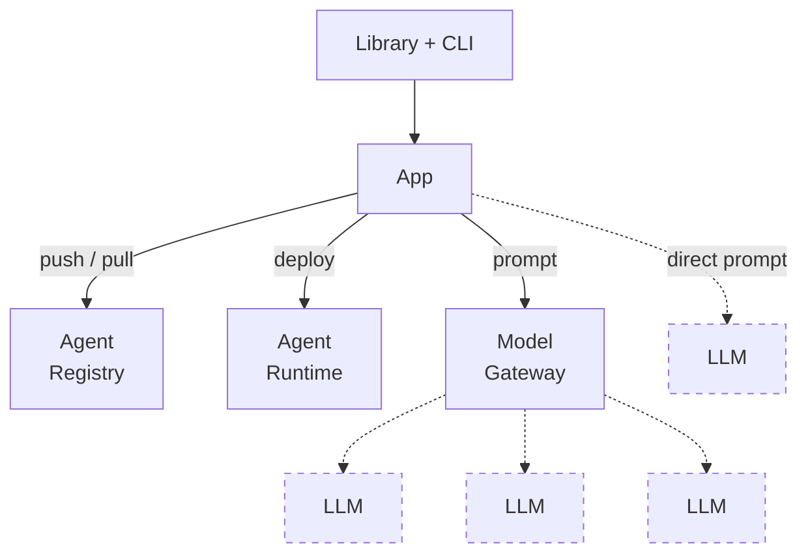

# Agentify Design Principles

- Declarative-first: YAML is the primary interface; Python is optional.
- Minimalism: Small, predictable API surface (run, chat, list).
- Provider-agnostic: Switch providers without rewriting agents.
- Predictability: Consistent behavior, validated YAML, versioning.
- Developer-first: CLI + notebooks for quick onboarding; clear errors.
- Extensibility: Optional memory, tools, and parameters; additive changes only.

## 1. Declarative-first

- Agents are defined in **YAML configuration**, not code
- Enables versioning, reproducibility, and ease of review
- Python API is an escape hatch, not the default

## 2. Minimalism

- Keep the API surface small:
  - `run` → single-shot prompts
  - `chat` → interactive session
  - `list` → discover agents
- Avoid unnecessary abstractions: no chains, graphs, or hidden layers

## 3. Provider-agnostic

- Abstract LLM providers behind a uniform interface
- Switching providers should **not require rewriting the agent logic**

## 4. Predictability

- Every agent behaves consistently across runs
- Explicit roles, versioning, and parameter control
- YAML schema validation ensures correctness before execution

## 5. Developer-first

- CLI and notebooks are **first-class experiences**
- Clear error messages and verbose/debug modes
- Easy to integrate into scripts, CI/CD, or orchestration pipelines

## 6. Extensibility

- Optional memory modules
- Optional tool integrations
- Optional advanced parameters for experimentation
- Always additive: new features **do not break existing YAML agents**

# Architecture

```mermaid
flowchart LR
    A[agent.yaml] -->|SPEC| B(<br/>🤖<br/>agent.py<br/>Instance<br/><br/>)
    C[agentify-toolkit] -->|SDK + CLI| B
    B(<br/>🤖<br/>AGENT<br/><br/>) --> |Prompt| D[LLM<br/>API]

    D[LLM<br/>API] --> E[GPT4.5]
    D[LLM<br/>API] --> F[Claude-Sonnet-4.5]
    D[LLM<br/>API] --> G[Gemini]
    D[LLM<br/>API] --> H[Grok]

```

# Ecosystem

