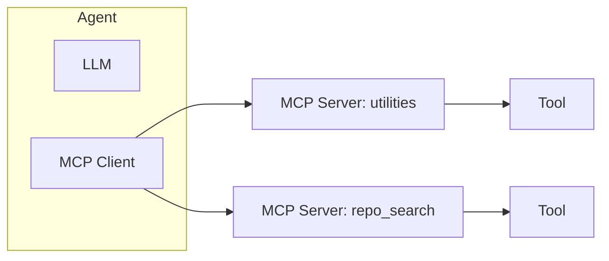
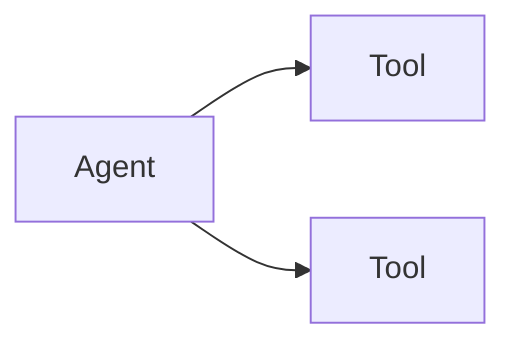
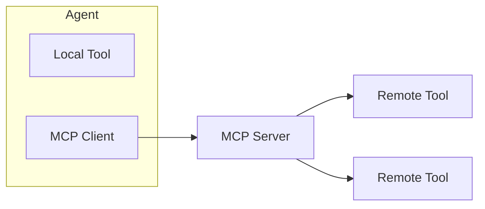

# MCP Integration

Agentify now supports Model Context Protocol (MCP).

With Agentify you can:

- Host your own MCP server
- Register tools dynamically
- Have agents connect to one or more MCP servers
- Consume third-party MCP servers
- Via the CLI you can inspect tool schema, invoke, register, and deregister tools

In addition to the `run`, `serve` and `deploy` semantics, Agentify provides the ablity to:

- Be an MCP Server
- Allow Agents to communicate to MCP Servers through its MCP client

## Architecture Overview

At runtime, Agentify agents can:

- Use local tools (declared in agent.yaml)
- Connect to one or more MCP servers
- Aggregate all tool schemas
- Invoke tools deterministically

Conceptually:



The agent:

1. Sends prompt + tool schemas to the LLM
2. Receives either natural language or a tool call
3. Routes tool calls to the correct MCP server
4. Returns tool output to the LLM for synthesis

## Hosting an MCP Server

Start an MCP Server:

```bash
agentify mcp start
```

By default this runs at:

```code
http://localhost:3333
```

Custom port:

```bash
agentify mcp start --port 4444
```

The MCP endpoint will be available at:

```code
http://localhost:3333/mcp
```

### Connecting an Agent to MCP

Declare MCP servers in yoru `agent.yaml`:

```yaml
name: luc
description: Multi Tool Agent
version: 0.1.0

model:
  provider: openai
  id: gpt-4
  api_key_env: OPENAI_API_KEY

role: Run MCP tools

tools:
  - random_user
  - add_numbers
  - user_api

mcp:
  servers:
    - name: utilities
      endpoint: http://localhost:3333/mcp

    - name: repo_search
      endpoint: https://mcp.deepwiki.com/mcp
```

Agentify supports attaching multiple MCP servers.

Each server is namespaced internally for deterministic routing.

## Tool Federation

When multiple MCP servers are attached:

- Tool names are namespaced internally
- Invocation is routed to the correct server
- Duplicate tool names across servers are supported

Example internal naming:

```code
utilities.add_numbers
repo_search.search
```

This ensures clean multi-server orchestration.

### Registering Tools to the MCP Server

Agentify allows dynamic tool registration.

Tools can be:

- API-based tools (tool.yaml)
- Function-based tools (tool.yaml + tool.py)
- Built-in tools

#### Register a Single Tool

```bash
agentify mcp register tool.yaml
```

#### Register a Folder of Tools

```bash
agentify mcp register path/to/tools
```

### API-Based Tool Example

```yaml
name: random_user
version: "1.0.0"
description: Generate random user data
vendor: RandomUser
endpoint: "https://randomuser.me/api/"

actions:
  get_user:
    method: GET
    path: /
    params:
      query:
        page: integer
        limit: integer
```

### Function-based Tool Example

tool.yaml

```yaml
name: add_numbers
type: internal
version: "1.0.0"
description: Add two numbers using Python function
vendor: built-in
function: add_numbers

params:
  a:
    type: number
    required: true
  b:
    type: number
    required: true
```

and the corresponding tool.py

```python
def add_numbers(a: float, b: float) -> float:
    return a + b
```

## MCP Client Support

Agentify includes a built-in MCP client that:

- Implements MCP `initialize`
- Supports `tools/list`
- Supports `tools/call`
- Aggregates tools across multiple servers
- Routes calls deterministically

This means your agent can connect to:

- Your own MCP servers
- Public MCP servers
- Third-party MCP providers

## CLI Reference

### Start MCP Server

```bash
agentify mcp start
```

### List Tools

```bash
agentify mcp list
agentify mcp list --debug # <-- for raw JSON
```

### Inspect Tool Schema

```bash
agentify mcp schema random_user
```

### Invoke Tool

```bash
agentify mcp invoke random_user
agentify mcp invoke add_numbers --args '{"a": 1, "b": 2}'
agentify mcp invoke random_user --debug # Returns raw JSON
```

### Register Tool

```bash
agentify mcp register tool.yaml
agentify mcp register tools/
```

### Deregister Tool

```bash
agentify mcp deregister mcp.random_user.get_user
```

## Local tools vs MCP Tools

Local tools declared directly in `agent.yaml`:



Agent with MCP federation:



### What MCP Enables

With MCP integration, Agentify supports:

- Tool modularity
- Server-based tool isolation
- Multi-agent shared tool registries
- Third-party tool ecosystems
- Federated tool orchestration
- Runtime dynamic registration

You can now:

- Develop tools independently
- Host them centrally
- Attach multiple servers to agents
- Swap tool backends without modifying agent logic

### Protocol Compliance

Agentify implements the MCP specification using JSON-RPC and supports:

- initialize
- tools/list
- tools/call

This ensures compatibility with other MCP-compliant servers and ecosystems.
