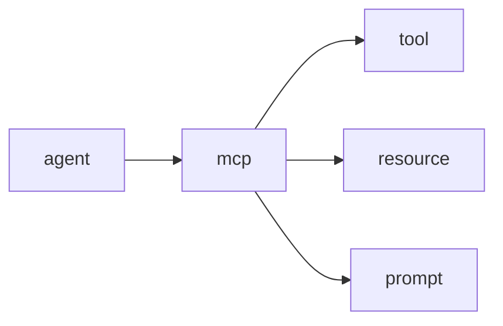

# MCP

## Concepts

```bash
# Start MCP Server
agentify mcp2 start

# List Tools
agentify mcp2 list
agentify mcp2 list --debug # Displays the raw JSON response from MCP Server


# Invoke Tools
agentify mcp2 invoke random_user
agentify mcp2 invoke random_user --debug # Use --debug for raw JSON response
agentify mcp2 invoke add --args '{"a": 1, "b": 2}'
agentify mcp2 invoke greet --args '{"name": "lewis"}'

# Get Tool schema
agentify mcp2 schema random_user

# Register Tool

# Register a single tool
agentify mcp2 register nadine/tools/random_user.yaml

# Register a folder of tools
agentify mcp2 register nadine/tools

# Deregister Tool
agentify mcp2 deregister mcp.random_user

# invoke Tool
agentify mcp2 invoke mcp.random_user --args '{"action": "get_user"}'
agentify mcp2 invoke mcp.add_numbers --args '{"a": 1, "b": 2}'

```


