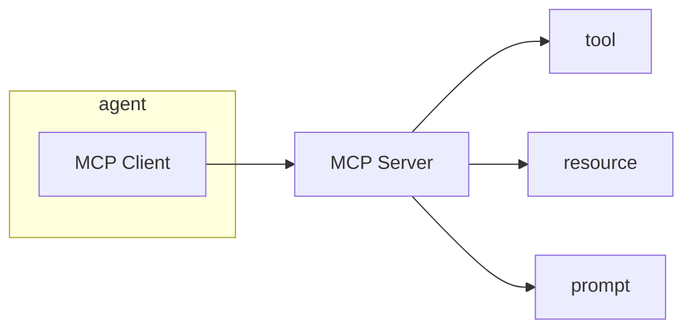
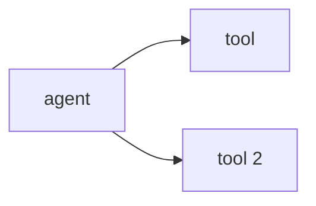
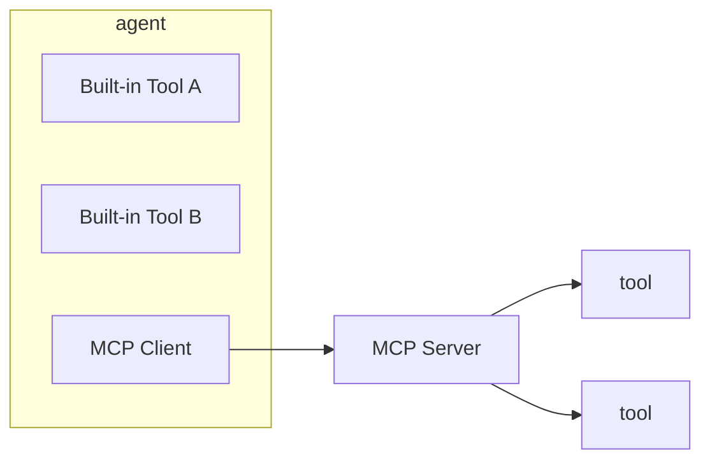

# MCP - Getting Started

Agentify can be used to host an MCP server:

```bash
agentify mcp start
```

This will host an MCP server at `http://localhost:3333/mcp`

You can also specify your own port using:

```bash
agentify mcp start --port 4444
```

By default, it will load tools from `builtin_tools.py`.

View the default loaded tools:

```bash
agentify mcp list
```

> Note: The MCP Server leverages Agentify Toolkit declarative tool files e.g. tool.yaml. It supports both API-based and function-based tools. Please refer to [Tool Documentation](../tools/README.md)

Then for your agent to access the MCP server, you simply declare the MCP server to your `agent.yaml` file:

```yaml
name: luc
description: Multi Tool Agent
version: 0.1.0
model:
  provider: openai
  id: gpt-4
  api_key_env: OPENAI_API_KEY
role: Run MCP tools
tools:
  - random_user
  - add_numbers
  - user_api

# MCP Server Declaration:
mcp:
  servers:
    - name: utilities
      endpoint: http://localhost:3333/mcp
    - name: repo_search
      endpoint: https://mcp.deepwiki.com/mcp
```

> Note: Agentify Agents support multiple MCP servers and uses the MCP Server name to namespace tools to avoid collisions e.g. utilities.echo, repo_search.echo are two separate tools.

## How this works

At runtime, the 'agentic loop' will send the tool schema along with the prompt and the LLM will respond with either a natural language response or a tool call (JSON).

The Agent will then match the tool call and invoke the MCP tool server with the tool invocation. This will then handle the call and then return a response back to the Agent.

The agent will return the response to the LLM for final synthesis and response back to the user/app.

### Declaring Tools

The MCP server has a `builtin_tools.py` which contain local functions.

However, you can use Agentify's declarative tools by taking existing tools and deploying them to the MCP Server.

#### Register a single tool to the MCP Server

```bash
agentify mcp register tool.yaml
```

A tool can be:

```yaml
name: random_user
version: "1.0.0"
description: Generate random user data
vendor: RandomUser
endpoint: "https://randomuser.me/api/"

actions:
  get_user:
    method: GET
    path: /
    params:
      query:
        page: integer
        limit: integer
```

or a local function tool:

```yaml
name: add_numbers
type: internal
version: "1.0.0"
description: Add two numbers using Python function
vendor: built-in
function: add_numbers
params:
  a:
    type: number
    required: true
  b:
    type: number
    required: true
```

With a corresponding tool.py:

```python
"""
Internal tool: add two numbers
"""

def add_numbers(a: float, b: float) -> float:
    """
    Adds two numbers and returns the result.

    Example:
        add_numbers(a=2, b=3) -> 5
    """
    return a + b

```

### How does this look conceptually ?



#### MCP Server

> MCP Protocol spec: Agentify implements the MCP using MCP spec which uses json-rpc `tools/list`, `tools/call` and `initiatialise` methods. Agentify augments with `tools/register` and `tools/deregister` to provide dynamic declarative tool loading.

Agent with local tools attached by declaring the tool names in the `agent.yaml`.



Agent with local tools attached and remote tools via MCP:



#### MCP Client

In addition to the implementation of an MCP server, Agentify has a built-in MCP client that can connect your agent to any MCP-compatible MCP server.

## CLI Command Reference

An MCP Server acts as a registration target for tools.

| Command                   |  Arguments  | Options                                | Description                                                                           |
| ------------------------- | :---------: | -------------------------------------- | ------------------------------------------------------------------------------------- |
| `agentify mcp start`      |             | `--port 8001`, `--tools path/to/tools` | Starts the Agent Runtime API Server                                                   |
| `agentify mcp list`       |             |                                        | List registered tools on server                                                       |
| `agentify mcp invoke`     | <tool_name> | `--args '{"a": 1, "b": 2}`             | Invoke a tool for testing                                                             |
| `agentify mcp register`   | <tool.yaml> | path/to/tools                          | Register Tools to the MCP Server                                                      |
| `agentify mcp deregister` | <tool_name> |                                        | Remove a registered tool                                                              |
| `agentify mcp schema`     | <tool_name> |                                        | Inspect the Tool Schema of a given tool, this is what is passed to the LLM at runtime |

> Note: The MCP Server is stateless and tools are loaded at runtime or registered after the server has started
