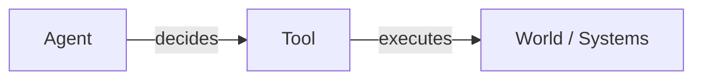
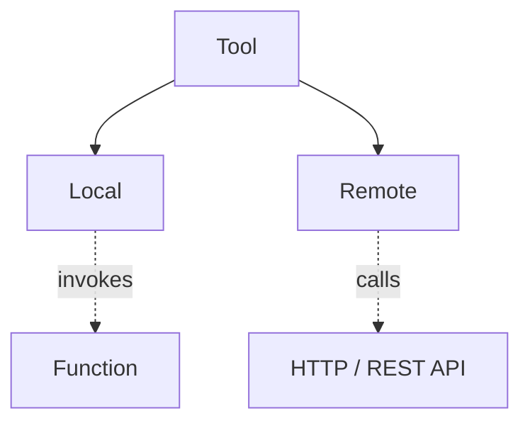
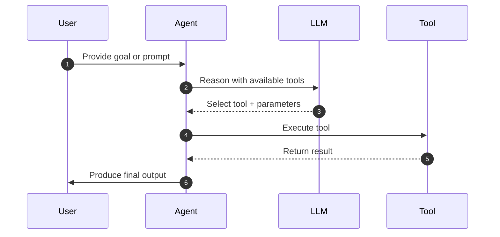

# Tools

1. [Overview](#1-overview)
2. [Why Tools Exist](#2-why-tools-exist)
3. [Tool Types](#3-tool-types)
4. [How Agents Use Tools](#4-how-agents-use-tools)
5. [Declarative Design Philosophy](#5-declarative-design-philosophy)
6. [Choosing the Right Tool Type](#6-choosing-the-right-tool-type)
7. [How to create tools](#7-how-to-create-tools)

## 1. Overview

Tools are how Agentify agents do things.

A tool represents a declarative capability that an agent may choose to invoke while working toward a goal. Tools allow agents to interact with systems, perform actions, and apply deterministic logic without embedding that logic inside the agent itself.

At a glance:

- Agents think and decide

- Tools execute actions

This separation is deliberate. It keeps agents focused on reasoning, while tools handle execution in a controlled, inspectable way.

## 2. Why Tools Exist

Tools exist to give agents real agency and the ability to affect systems beyond text generation.

They allow agents to:

- Perform real-world actions (API calls, data retrieval, mutations)

- Execute deterministic logic (calculations, transformations)

- Integrate with existing systems and services

- Remain declarative, portable, and easy to reason about

Without tools, agents can only describe actions. With tools, agents can take actions.

## 3. Tool Types

Agentify supports two tool types, distinguished by where execution happens.

This distinction is intentional and forms the core mental model for tools:

### 3.1 Local Tools

Local tools execute **inside the Agentify runtime**. They are backed by Python functions that are loaded dynamically at runtime.

Typical use cases:

- Calculations and data transformations

- File or system operations

- Glue logic between multiple tools

- Rapid prototyping and experimentation

Key characteristics:

- Executed in-process

- Implemented as Python functions

- Declared via YAML and bound to code

- Scoped to the agent or solution

#### 3.2 Remote Tools

Remote tools execute **outside the Agentify runtime** and are accessed over the network, typically via HTTP APIs.

Typical use cases:

- SaaS APIs (GitHub, Jira, Slack)

- Internal services and microservices

- Automation endpoints and webhooks

Key characteristics:

- Executed remotely

- Defined entirely via YAML

- Invoked using HTTP requests

- Suitable for distributed and serverless environments

## 4. How Agents Use Tools

Tools are not executed automatically. They are made available to an agent, which may decide to invoke them as part of its reasoning process.

At runtime, the flow looks like this:

This design cleanly separates:

- Decision-making (LLM + agent)

- Execution (tools)

## 5. Declarative Design Philosophy

Tools in Agentify are interfaces, not implementations.

Each tool is defined declaratively using YAML, describing:

- What capability the tool provides
- What actions or functions are available
- What parameters are accepted

The agent does not need to know:

- How a remote API is implemented
- How a local function is written
- Where the execution physically occurs

This makes tools:

- Easy to version

- Easy to replace or mock

- Safe to expose to language models

## 6. Choosing the Right Tool Type

Choosing between local and remote tools is primarily about execution boundaries.

Use a local tool when:

- Logic must run close to the agent

- You need fast, deterministic execution

- You are transforming or enriching data

- You are prototyping or experimenting

Use a remote tool when:

- Interacting with external systems

- Calling shared services or APIs

- You need network isolation or scalability

- Execution should happen outside the agent process

## 7. How to create tools

This document focuses on concepts and mental models.

For practical guidance, see:

- Local tool implementation and examples

- Remote tool implementation and examples

- Tool schema reference

- Agent runtime and execution lifecycle

Each of these topics is covered in dedicated documentation to keep concepts and usage clearly separated.
