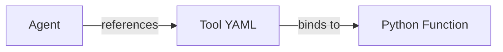

# Local Tools

1. [Overview](#1-overview)
2. [When to use a local tool](#2-when-to-use-a-local-tool)
3. [How Local tools work](#3-how-local-tools-work)
4. [File Structure](#4-file-structure)
5. [Defining a Local Tool (YAML)](#5-defining-a-local-tool-yaml)
6. [Implementing a Python function](#6-implementing-the-python-function)
7. [Liking a Local Tool to an Agent](#7-linking-a-local-tool-to-an-agent)
8. [Execution Flow](#8-execution-flow)
9. [Common Pitfuls](#9-common-pitfalls)
10. [Design Principles](#10-design-principles)
11. [Next Steps](#11-next-steps)

## 1. Overview

Local tools allow Agentify agents to execute Python functions directly inside the Agentify runtime.

They are ideal for deterministic logic, data transformations, and glue code that should run close to the agent with minimal latency and maximum control.

A local tool is defined declaratively (YAML) and bound to an implementation (Python). The agent only sees the capability, not the code.

## 2. When to Use a Local Tool

Use a local tool when:

- Logic must run close to the agent

- You need fast, deterministic execution

- You are transforming or enriching data

- You are coordinating multiple tools

- You are prototyping or experimenting locally

Avoid local tools when:

- Execution must be isolated or sandboxed remotely

- You are integrating with an external SaaS or shared service

- You need network-level scaling or rate limiting

## 3. How Local Tools Work

A local tool has three parts:

1. An agent that references the tool by name

2. A tool definition (tool.yaml) that declares the capability

3. A Python function that implements the logic



The function is dynamically imported and loaded at agent runtime.

## 4. File Structure

Local tools are typically placed in a `tools/` directory relative to the agent definition.

```bash
solution/
├── agent.yaml
└── tools/
    ├── __init__.py
    ├── add_numbers.yaml
    └── add_numbers.py
```

This structure keeps tool logic discoverable and colocated with the agent or solution.

> **Important Note**: you must put a `__init__.py` file wihtin tools so Python treats it as a package for import. The file can be empty.

## 5. Defining a Local Tool (YAML)

A local tool is declared using a YAML file. This file describes what the tool does and how it is invoked.

Example: `add_numbers.yaml`

```yaml
name: add_numbers
type: local
version: "1.0.0"
description: Add two numbers using a local Python function
vendor: built-in

module: tools.add_numbers
function: add_numbers

params:
  a:
    type: number
    required: true
  b:
    type: number
    required: true
```

### Key Fields

- `type:` Must be set to `local`

- `module:` Python module path used for import

- `function:` Function name to invoke

- `params:` Parameter schema exposed to the agent

The parameter schema is what the language model sees and reasons about.

## 6. Implementing the Python Function

The Python function contains the actual tool logic.

Example: `add_numbers.py`

```python
def add_numbers(a: float, b: float) -> float:
    """
    Adds two numbers and returns the result.

    Example:
    add_numbers(a=2, b=3) -> 5
    """
    return a + b
```

Guidelines:

- Keep functions deterministic where possible

- Avoid side effects unless intentional

- Prefer explicit parameters over `**kwargs`

The function signature should match the parameters defined in YAML.

## 7. Linking a Local Tool to an Agent

Agents reference tools by name in their configuration.

Example: `agent.yaml`

```yaml
name: local_demo
description: Demonstrate local tool usage
version: 0.1.0
model:
  provider: anthropic
  id: claude-sonnet-4-5
  api_key_env: ANTHROPIC_API_KEY
role: |
  You are a helpful assistant.
  Use tools when appropriate.
tools:
  - add_numbers
```

Once referenced, the tool becomes available to the agent during execution.

## 8. Execution Flow

At runtime:

1. The agent exposes the local tool schema to the language model

2. The language model selects the tool and provides parameters

3. Agentify validates the parameters against the schema

4. The Python function is executed in-process

5. The result is returned to the agent

This ensures:

- Safe invocation

- Predictable execution

- Clear separation between reasoning and logic

## 9. Common Pitfalls

- Incorrect module paths: Ensure the module path is importable

- Mismatched parameters: YAML schema must match the function signature

- Hidden side effects: Be explicit when tools mutate state or files

- Overloading tools: Prefer small, focused tools over monolithic ones

## 10. Design Principles

Local tools are most effective when they are:

- Small and focused

- Deterministic and predictable

- Easy to reason about

- Easy to test independently

Think of local tools as pure capabilities, not mini-agents.

## 11. Next Steps

- See _Remote Tools_ for HTTP-based integrations

- See _Tool Schema_ Reference for full YAML field definitions

- See _Agent Runtime_ documentation for execution details
