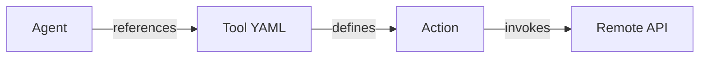

# Remote Tools

1. [Overview](#1-overview)
2. [When to use a Remote Tool](#2-when-to-use-a-remote-tool)
3. [How Remote Tools Work](#3-how-remote-tools-work)
4. [File Structure](#4-file-structure)
5. [Defining a Remote Tool (YAML)](#5-defining-a-remote-tool-yaml)
6. [Actions](#6-actions)
7. [Parameters and Validation](#7-parameters-and-validation)
8. [Linking a Remote Tool to an Agent](#8-linking-a-remote-tool-to-an-agent)
9. [Execution Flow](#9-execution-flow)
10. [Design Principles](#10-design-principles)
11. [Common Pitfalls](#11-common-pitfalls)
12. [Next Steps](#12-next-steps)

## 1. Overview

Remote tools allow Agentify agents to execute actions outside the Agentify runtime via network calls, typically over HTTP.

They are the primary way for agents to interact with external systems such as SaaS platforms, internal services, and automation endpoints.

Remote tools are purely declarative: they describe an interface to a remote capability, not its implementation.

## 2. When to Use a Remote Tool

Use a remote tool when:

- Interacting with external systems or SaaS platforms

- Calling shared internal services or microservices

- Execution must be isolated from the agent runtime

- You need network-level scalability or rate limiting

- The capability already exists behind an API

Avoid remote tools when:

- Logic is simple and deterministic
  Execution must be low-latency and in-process

- You are primarily transforming data
  If in doubt: local tools compute, remote tools integrate.

## 3. How Remote Tools Work

A remote tool defines:

- A base API endpoint
- One or more callable actions
- The parameters each action accepts

At runtime, the agent selects an action and provides parameters. Agentify handles request construction, execution, and response handling.



The agent never constructs HTTP requests directly. All network interaction flows through the tool interface.

## 4. File Structure

Remote tools are typically colocated with agents or shared across solutions.

```bash
solution/
├── agent.yaml
└── tools/
    └── random_user.yaml
```

> Because remote tools contain no executable code, a single YAML file is sufficient.

## 5. Defining a Remote Tool (YAML)

A remote tool is defined using a YAML file that declares the API interface.

Example: random_user.yaml

```yaml
name: random_user
version: "1.0.0"
description: Generate random user data
vendor: RandomUser
endpoint: "https://randomuser.me/api/"

actions:
    get_user:
    method: GET
        path: /
        params:
        query:
        page: integer
        results: integer
```

## 6. Actions

Actions represent callable operations exposed by the remote API.

Each action defines:

- HTTP method
- Path relative to the base endpoint
- Parameter locations (query, path, body, headers)

Agents reason about actions as discrete capabilities, not HTTP mechanics.

## 7. Parameters and Validation

Parameter schemas serve two purposes:

1. They guide the language model when constructing tool calls

2. They allow Agentify to validate inputs before execution

Supported parameter locations typically include:

- query
- path
- body
- headers

Clear parameter definitions improve both correctness and agent reliability.

## 8. Linking a Remote Tool to an Agent

Agents reference remote tools by name.

Example: agent.yaml

```yaml
name: remote_demo
description: Demonstrate remote tool usage
version: 0.1.0

model:
  provider: anthropic
  id: claude-sonnet-4-5
  api_key_env: ANTHROPIC_API_KEY

role: |
  You are a helpful assistant.
  Use tools when appropriate.

tools:
  - random_user
```

Once referenced, all actions defined by the tool become available to the agent.

## 9. Execution Flow

At runtime:

1. The agent exposes remote tool schemas to the language model

2. The language model selects an action and provides parameters

3. Agentify validates parameters against the schema

4. An HTTP request is constructed and executed

5. The response is returned to the agent

This ensures consistent, inspectable, and safe API interaction.

## 10. Design Principles

Well-designed remote tools are:

- Explicit and well-scoped

- Stable and versioned

- Clear about required vs optional parameters

- Designed around actions, not raw endpoints

Avoid exposing entire APIs blindly. Prefer small, intentional interfaces.

## 11. Common Pitfalls

- Overly broad tools: Exposing too many actions reduces agent reliability

- Poor parameter schemas: Ambiguous parameters lead to invalid calls

- Leaking HTTP complexity: Agents should not reason about headers or URLs

- Unstable APIs: Version remote tools defensively

## 12. Next Steps

- See _Local Tools_ for in-process execution
- See _Tool Schema Reference_ for full YAML field definitions
- See _Agent Runtime_ documentation for execution details
